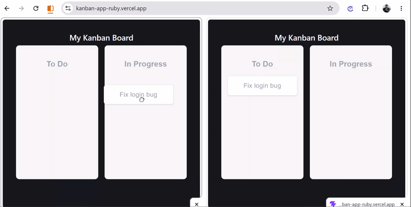

# Real-Time Kanban Board

A full-stack MERN Kanban board with live drag-and-drop sync across multiple users, built to explore WebSockets, optimistic UI, and concurrency handling.

**Live demo:** https://kanban-app-ruby.vercel.app/

## Features

- Real-time card sync across browser sessions using Socket.io
- Optimistic UI updates — drag actions feel instant, not waiting on server round-trips
- Room-based architecture — updates only broadcast to users viewing the same board
- Presence tracking — see who else is currently viewing a board
- Optimistic locking to handle concurrent edits (see below)
- - Full authentication flow — signup, login, and protected routes using JWT and bcrypt password hashing, with session persistence via localStorage
- Full REST CRUD for boards, columns, and cards

## Handling Concurrent Edits

When two users drag the same card at nearly the same time, a naive
implementation would let whichever update arrives last silently overwrite
the other — the first user's action disappears with no explanation.

This project uses **optimistic locking** to prevent that:

- Every Card document has a version number, starting at 0.
- When a client emits a card move, it includes the version it last saw.
- The server compares that version against the current value in MongoDB.
- If they match, the update is applied and version is incremented.
- If they don't match, the update is rejected and the client receives
  the latest card data instead of blindly overwriting someone else's change.

## Tech Stack

**Frontend:** React, Vite, Zustand, Socket.io-client, @hello-pangea/dnd, react-hot-toast
**Backend:** Node.js, Express, Socket.io, MongoDB (Mongoose), JWT, bcrypt
**Deployment:** Vercel (frontend), Render (backend), MongoDB Atlas (database)

## Running Locally

### Backend
\\\
cd server
npm install
npm run dev
\\\

Create a \.env\ file in \server/\ with:
\\\
MONGO_URI=your_mongodb_connection_string
JWT_SECRET=your_secret_key
PORT=5000
\\\

### Frontend
\\\
cd client
npm install
npm run dev
\\\

## Architecture Notes

- Socket.io rooms are used per-board so updates don't broadcast to unrelated users
- The Zustand store is the single source of truth on the client; both drag events and incoming socket events write to the same state
- Rollback on conflict works by letting the server's correction event overwrite the optimistic guess, rather than maintaining a separate undo stack
